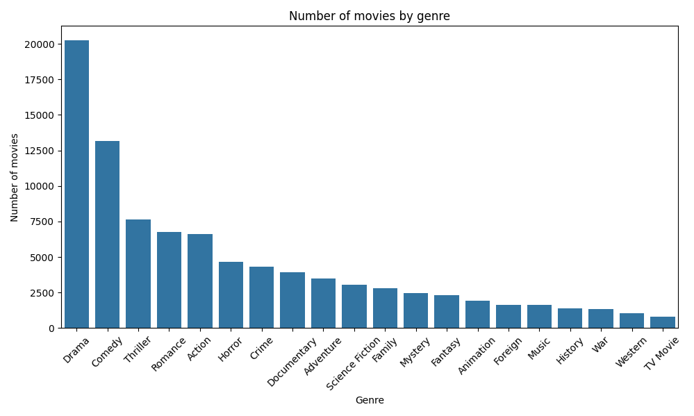
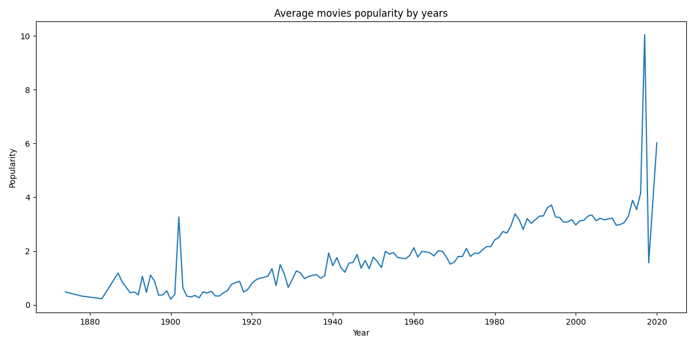

# Data analysis of the Movie inndustry

This project does analysis of the dataset (movies_metadata.csv) with information about movies.

Goal: to indetify key trends, popular genres, connect between budget and revenue, research changes of movies popularity for years.

## Data

Used dataset contains 45,466 entries and 24 colunms.

Main columns:
- `title`: Movie name.
- `budget`: Movie bugdet.
- `revenue`: Movie revenue.
- `release_date`: Release date.
- `genres`: Movie genres in format JSON.
- `populariry`: Popularity count.
- `vote_average`: Average rate.

### Data cleanup
1. Deleted entries without date, incorrect budgets or revenues
2. Split genres from JSON format into separate rows.
3. Added new columns: `release_year` (year of release)

## Results

### 1. Genres popularity
The graph bellow shows number of movies for each genre.
Most popularity genres:
- **Drama**
- **Comedy**
- **Thriller**

### 2. Popularity trends
Over the years the popularity of movies has grown. It can be seen by looking at the graph of movies popularity by years:

