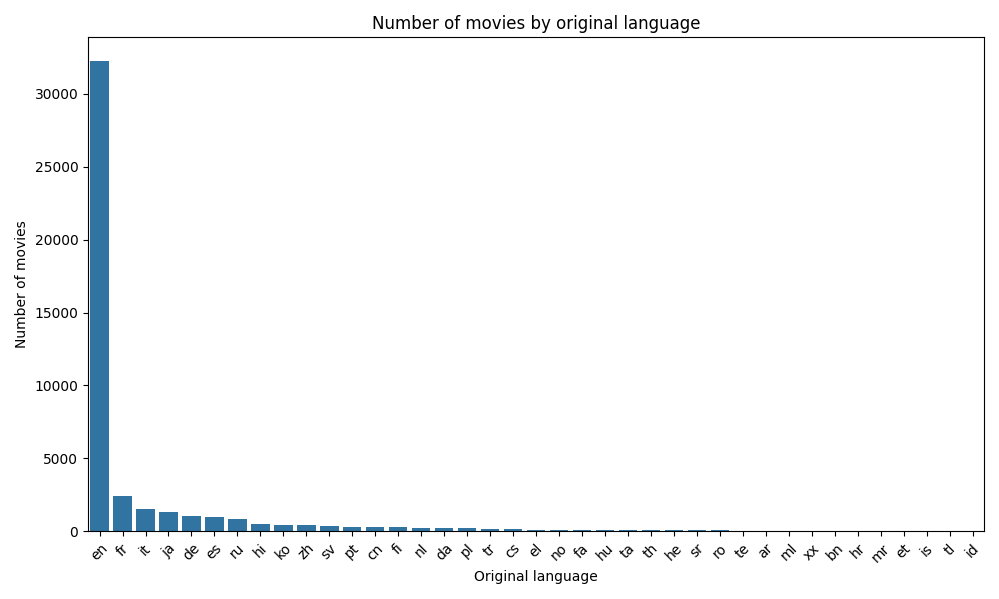
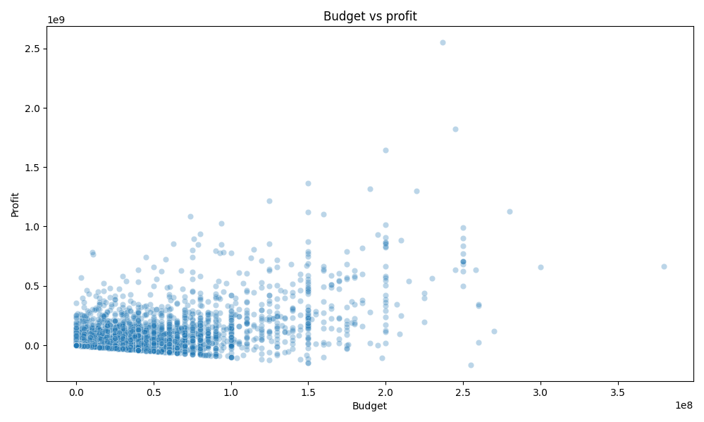

# Data analysis of the Movie inndustry

This project does analysis of the dataset (movies_metadata.csv) with information about movies.

Goal: to identify key trends, popular genres, connect between budget and revenue, research changes of movies popularity for years.

## Data

Used dataset contains 45,466 entries and 24 columns.

Main columns:
- `title`: Movie name.
- `budget`: Movie budget.
- `revenue`: Movie revenue.
- `release_date`: Release date.
- `genres`: Movie genres in format JSON.
- `popularity`: Popularity count.
- `vote_average`: Average rate.

### Data cleanup
1. Deleted entries without date, incorrect budgets or revenues
2. Split genres from JSON format into separate rows.
3. Added new columns: `release_year` (year of release) and `profit` (profit)

## Results

### 1. Genres popularity
The graph bellow shows number of movies for each genre.
Most popularity genres:
- **Drama**
- **Comedy**
- **Thriller**


### 2. Popularity trends
Over the years the popularity of movies has grown. It can be seen by looking at the graph of movies popularity by years:


### 3. Original language popularity
The popularity of the original language of each film is plotted on the graph:



### 4. Budget vs Profit
The relationship between budget and profit shows that high-budget films tend to be more profitable:




## How to repeat the analyze?

1. **Clone the repository**:

    ```bash
    git clone <URL-of-repository>
    ```
2. **Download the requirements**:  

    Make sure you have installed python 3.8+ and its libraries.
    ```bash
    pip install pandas matplotlib seaborn
    ```
3.  **Run the script**:

    Run `main.py` for automized analyze:
    ```bash
    python main.py
    ```
4. **View the results**
    Cleaned dataset will be saved as `cleaned_movies_metadata.csv`, and graphs as:
    - `genres_popularity.png`
    - `trends_popularity.png`
    - `original_language_amount.png`
    - `budget_vs_profit.png`
    

## Contacts
If you have any questions, you can contact us: vertru112211@gmail.com

Thank you for using our project!
